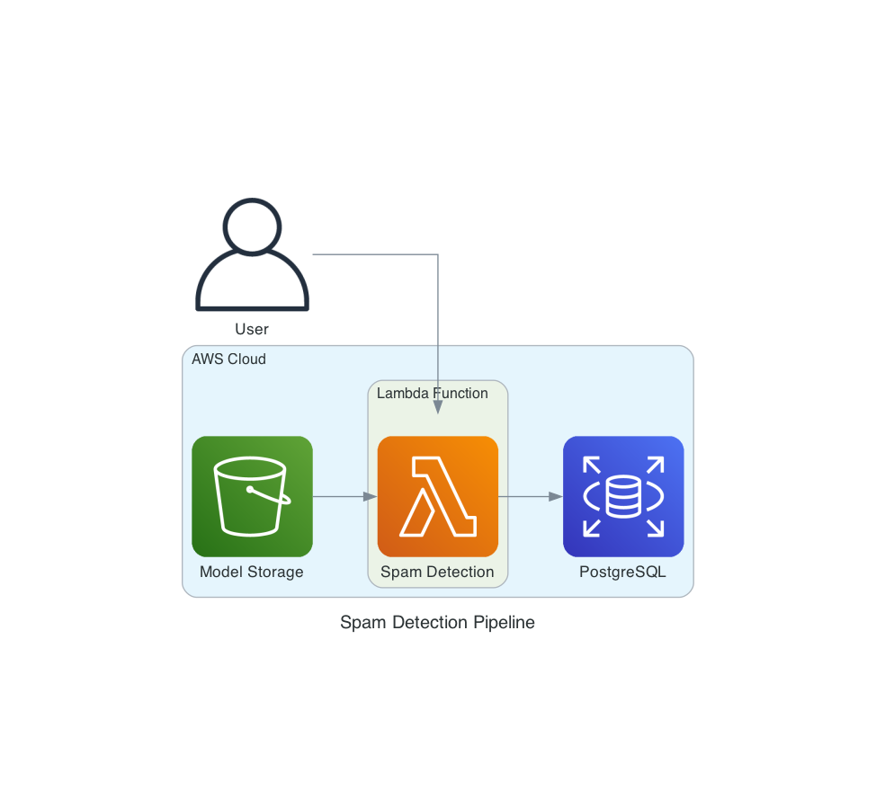

# Spam Detection Lambda Function



This project implements a serverless spam detection system using AWS Lambda, S3, and PostgreSQL. It uses a pre-trained machine learning model to classify text as spam or not spam, and stores the results in a database.

## Features

- Spam detection using a pre-trained Logistic Regression model
- Text vectorization using TF-IDF
- AWS Lambda integration
- S3 for model and vectorizer storage
- PostgreSQL for result storage
- Environment variable configuration for secure credential management

## Prerequisites

- AWS account with access to Lambda, S3, and RDS (PostgreSQL)
- Python 3.8+
- Required Python packages (see `requirements.txt`)

## Setup

1. Clone the repository
2. Install required packages:
    ```bash
    pip install -r requirements.txt
    ```
3. Set up your `.env` file with the following variables:
    ```bash
    AWS_ACCESS_KEY_ID=your_access_key_id
    AWS_SECRET_ACCESS_KEY=your_secret_access_key
    AWS_REGION=your_aws_region
    S3_BUCKET=your_s3_bucket
    DB_HOST=your_db_host
    DB_NAME=your_db_name
    DB_USER=your_db_user
    DB_PASSWORD=your_db_password
    DB_PORT=your_db_port
    ```

## Usage

The main function `lambda_handler` is triggered by AWS Lambda. It expects an event with a JSON body containing a 'text' field:

```json
{
"body": "{\"text\": \"Sample text to classify\"}"
}
```

The function will:
Load the model and vectorizer from S3
Classify the input text
Store the result in the PostgreSQL database
Return the classification result
## File Structure
lambda_function.py: Main Lambda function code
requirements.txt: Required Python packages
.env: Environment variables (not included in repository)
src/tests/test_event.json: Sample event for local testing
## Local Testing
To test the function locally:
Ensure your .env file is set up correctly
Run the script:
```bash
python lambda_function.py
```

This will use the test event in src/tests/test_event.json to simulate a Lambda invocation.
## Deployment
To deploy to AWS Lambda:
Package the code and dependencies
Upload to AWS Lambda
Configure environment variables in the Lambda console
Set up appropriate IAM roles for S3 and RDS access
## Security
Ensure that your AWS credentials and database credentials are kept secure
Use IAM roles and policies to restrict access as much as possible
Regularly rotate credentials and update environment variables
## Contributing
Contributions are welcome! Please feel free to submit a Pull Request.